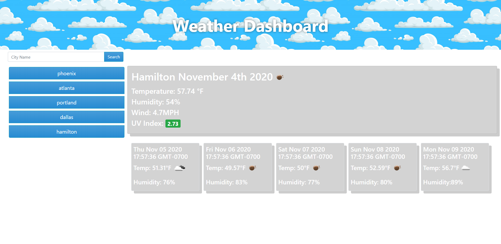

# weather-dashboard
## [Application Link](https://beachybeach.github.io/weather-dashboard/)

## Screenshot

This is a weather dashboard that provides real time data to any U.S. city. The user is able to search any city in the search bar and see the current days weather as well as a five day forecast.

# Uses 
To know when you need to wear a jacket! 

# Built With
- HTML
- CSS
- Javascript
- Bootsrap
- Open Weather API 